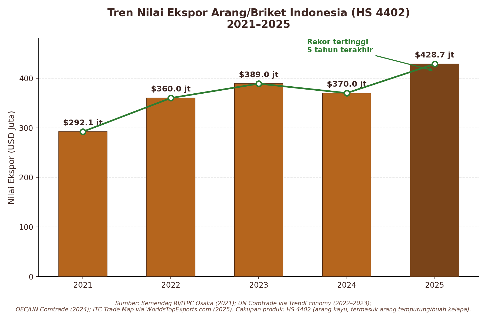

Ekspor arang tempurung kelapa Indonesia mencapai **203.010 ton** pada 2024, menurut Kementerian Pertanian. Pembeli dari Timur Tengah hingga Eropa mengimpor briket arang kelapa dari Indonesia.

Di tengah pergeseran global ke bahan bakar yang lebih bersih, briket arang tempurung kelapa, yang dibuat dari limbah pertanian tropis, menjadi produk yang banyak dicari di pasar internasional. Dari dapur restoran di Berlin hingga meja shisha di Riyadh, Indonesia sering disebut sebagai acuan kualitas negara asal.

Data pemerintah, statistik FAO, dan pernyataan pelaku industri menunjukkan pola yang konsisten: Indonesia adalah produsen kelapa terbesar di dunia sekaligus eksportir arang tempurung kelapa dengan volume yang naik pada tahun-tahun yang tercakup data resmi. Artikel ini menyajikan data utama bagi pembeli luar negeri yang mencari pasokan briket arang kelapa yang stabil, berkualitas, dan berkelanjutan.

## Data Ekspor Resmi: Tiga Tahun Berturut-turut Tumbuh

Berdasarkan *2025 Coconut Commodity Outlook* yang diterbitkan Pusat Data dan Sistem Informasi Pertanian (Pusdatin), Sekretariat Jenderal Kementerian Pertanian Republik Indonesia, dengan data olahan dari Direktorat Jenderal Perkebunan dan Badan Pusat Statistik (BPS), volume ekspor arang tempurung kelapa Indonesia dengan **kode Harmonized System (HS) 4402.20.10** adalah sebagai berikut:

| Tahun | Volume Ekspor | Pertumbuhan (YoY) |
| :--- | :--- | :--- |
| **2022** | 155.730 ton | Tahun dasar (setelah pemisahan kode HS) |
| **2023** | 191.170 ton | +22,8% |
| **2024** | 203.010 ton | +6,2% |

Sejak 2022, pemerintah memisahkan kode HS arang tempurung kelapa (`4402.20.10`) dari kode arang kelapa umum (`4402.90.10`) agar data pelacakan lebih akurat. Sejak pemisahan itu, volume ekspor arang tempurung kelapa naik selama tiga tahun berturut-turut.[1, 2]

Data pengapalan ekspor komersial untuk periode berjalan 2026 memberi gambaran sementara tentang arah pasar. Nilai ekspor briket Indonesia mencapai sekitar **US$56,5 juta** dari lebih dari 1.600 pengapalan, dan briket arang tempurung kelapa menyumbang sekitar **84,6%** dari total nilai ekspor briket, jauh di atas arang kayu dan jenis arang lainnya.[3]

Pada 2023, total nilai ekspor arang dan briket dari Indonesia, dengan arang tempurung kelapa sebagai kontributor utama, tercatat hampir **US$466 juta**, atau sekitar **43 persen** pasar ekspor arang global menurut basis data ITC Trade Map.[4] Badan Pusat Statistik juga mencatat pertumbuhan rata-rata nilai ekspor briket arang kelapa sekitar **15 persen per tahun** dalam beberapa tahun terakhir.[2] Angka-angka ini mencakup lingkup dan periode yang berbeda (seluruh arang dan briket pada 2023, hanya briket pada periode berjalan 2026), sehingga tidak dapat dibandingkan langsung.

Angka final tahunan resmi untuk 2025 dan 2026 tidak dimuat dalam artikel ini. Tren tiga tahun bertumpu pada data resmi 2022 sampai 2024. Angka pengapalan 2026 berasal dari catatan komersial dan bersifat sementara, sehingga menunjukkan arah pasar, bukan angka final.

*Grafik: nilai ekspor arang dan briket Indonesia dengan kode HS 4402 (termasuk arang kayu), 2021 sampai 2025. Angka berasal dari basis data yang disebut pada grafik, yang berbeda dari angka ITC Trade Map 2023 di atas.*

## Mengapa Indonesia Sering Dijadikan Acuan

Jawabannya dimulai dari bahan baku. Menurut data Food and Agriculture Organization (FAO) yang diolah Pusdatin Kementerian Pertanian, Indonesia adalah produsen kelapa terbesar di dunia dengan kontribusi rata-rata **27,28 persen** terhadap produksi kelapa global pada 2019 sampai 2023, di atas Filipina (23,14%) dan India (22,10%).[1]

Pasokan bahan baku yang besar ini memberi Indonesia keunggulan struktural. Tempurung kelapa tersedia di lebih dari 30 provinsi, antara lain Riau, Sulawesi Utara, Jawa Timur, dan Maluku Utara.[1]

Namun volume saja tidak menentukan keputusan pembelian. Kualitas juga menjadi faktor penentu bagi pembeli internasional.

* Dalam *2025 Coconut Commodity Outlook*, Pusdatin Kementerian Pertanian menyebut arang kelapa Indonesia termasuk yang terbaik di dunia.[1]
* *2025–2045 Coconut Downstreaming Roadmap* yang disusun Kementerian PPN/Bappenas mencatat bahwa karakteristik arang Indonesia dinilai lebih unggul dibanding arang dari negara lain, faktor kunci keberhasilan Indonesia memasok briket shisha ke pasar global.[5]

## Karakteristik Umum yang Disebut dalam Referensi Industri

Bagi pembeli, klaim kualitas perlu bisa diukur. Karakteristik berikut disebut dalam referensi industri sebagai pemenuhan standar kualitas ekspor untuk briket arang kelapa Indonesia.[3] Karakteristik ini menggambarkan kategori produk secara umum dan bukan spesifikasi produk pemasok tertentu.

1. **Nilai kalor tinggi dan stabil:** Memberi panas yang kuat untuk shisha, barbekyu, dan aplikasi industri.
2. **Waktu bakar lama:** Terbakar konsisten selama 2 sampai 3 jam tanpa sering diganti, hal yang penting bagi pengelola lounge shisha dan restoran panggang.
3. **Kadar abu rendah:** Di bawah 2,5 sampai 3 persen, lebih bersih dibanding arang kayu atau batu bara.
4. **Asap sedikit dan tanpa bau menyengat:** Menghasilkan asap minimal dan tidak berbau menyengat, sehingga tidak memengaruhi rasa makanan atau tembakau shisha.

Referensi industri memosisikan karakteristik ini sebagai alasan briket arang kelapa Indonesia menjadi pengganti arang kayu yang berkelanjutan di pasar Eropa yang peka terhadap deforestasi, sekaligus bahan bakar acuan yang umum bagi industri shisha di Timur Tengah.[6]

Pelaku usaha swasta memiliki pandangan serupa. Pemilik produsen briket arang kelapa di Magelang, Jawa Tengah, yang mengekspor ke Amerika Serikat, Eropa, Australia, Asia, dan Timur Tengah sejak 2018, menyatakan bahwa pembeli dari berbagai negara datang langsung ke Indonesia untuk mencari briket shisha karena kualitasnya yang konsisten.[7]

## Ke Mana Briket Arang Kelapa Indonesia Dikirim

Peta ekspor briket arang kelapa Indonesia mencakup beragam pasar:

* **Timur Tengah:** Arab Saudi, Turki, Lebanon, Irak, Yordania, dan Uni Emirat Arab menjadi pasar utama, didorong permintaan briket shisha (hookah) premium. Data pengapalan terbaru menempatkan Arab Saudi sebagai tujuan tunggal terbesar, dengan nilai perdagangan di atas **US$10 juta**.[3]
* **Eropa:** Jerman menjadi pintu masuk utama ke Eropa Barat, disusul Belanda dan Belgia, terutama untuk pasar bahan bakar barbekyu ramah lingkungan.[2, 3]
* **Pasar berkembang:** Rusia, Brasil, dan Amerika Serikat menunjukkan permintaan yang tumbuh untuk briket BBQ premium dan produk biomassa ramah lingkungan di luar pasar tradisional Timur Tengah.[3]
* **Asia:** Tiongkok rutin mengimpor arang kelapa untuk karbon aktif di industri kosmetik dan kimia, sementara Jepang dan Korea Selatan konsisten mengimpornya untuk kebutuhan energi alternatif.[2]

*Grafik: 10 negara tujuan utama ekspor briket arang Indonesia menurut pangsa nilai ekspor, dari cuplikan data pengiriman TradeInt Indonesia yang diakses pada 2026.*

Permintaan global briket arang kelapa diproyeksikan tumbuh rata-rata **4,3 persen** per tahun pada 2024 sampai 2031. Nilai pasar global pada 2024 diperkirakan melampaui **US$421 juta**, menurut riset Cognitive Market Research. Kawasan Asia-Pasifik tumbuh paling cepat, sedangkan Eropa dan Amerika Utara tetap menjadi pasar bernilai tertinggi karena preferensi terhadap bahan bakar ramah lingkungan.[2]

## Tantangan Rantai Pasok

Rantai pasok briket arang kelapa Indonesia juga menghadapi tantangan struktural.

Sebagian petani masih menjual kelapa butir utuh ke luar negeri alih-alih mengolahnya di dalam negeri menjadi tempurung siap produksi, yang dapat menyebabkan hambatan sementara pada bahan baku produsen briket dalam negeri.[2] Menanggapi hal ini, asosiasi pengusaha briket arang kelapa Indonesia (HIPBAKI) mendorong pemerintah memprioritaskan hilirisasi. Pemerintah saat ini sedang mengevaluasi bea keluar atas kelapa butir utuh untuk melindungi ketersediaan bahan baku bagi produsen dalam negeri.[2, 3]

Bagi pembeli internasional, dinamika ini menjadi sinyal bahwa kemitraan dengan eksportir yang memiliki rantai pasok stabil dan legalitas produksi yang jelas dapat semakin bernilai. Kemitraan sejak awal dengan pemasok Indonesia yang kredibel dapat mendukung akses pasokan seiring meningkatnya persaingan pasar.

## Kesimpulan

Data menunjukkan hal-hal berikut:

1. Volume ekspor naik selama tiga tahun berturut-turut.
2. Indonesia tetap menjadi produsen kelapa terbesar di dunia.
3. Lembaga pemerintah dan perencanaan pembangunan menggambarkan kualitas arang Indonesia sebagai kekuatan.
4. Referensi industri menggambarkan karakteristik teknis yang memenuhi standar kualitas ekspor di pasar Eropa, Timur Tengah, dan Amerika.

Bagi pembeli yang sedang mengevaluasi pemasok briket arang kelapa untuk kontrak pasokan jangka panjang, membeli dari negara dengan basis bahan baku kelapa terbesar dan rekam jejak ekspor yang tumbuh memberi keuntungan operasional.

## Referensi

1. Center for Agricultural Data and Information Systems (Pusdatin), Secretariat General of the Ministry of Agriculture of the Republic of Indonesia. *2025 Coconut Commodity Outlook* (export data processed from the Directorate General of Estates and Statistics Indonesia; world production data sourced from FAO). Jakarta, 2025. Tersedia di: [satudata.pertanian.go.id](https://satudata.pertanian.go.id).
2. Kompas.com (Agri Kompas). *"Briket Arang Kelapa: Limbah Jadi Komoditas Ekspor,"* terbit 8 Desember 2025, mengutip data Badan Pusat Statistik dan Cognitive Market Research.
3. TradeInt Indonesia. *"Ekspor Briket Indonesia 2026: Negara Tujuan, Jenis Produk, dan Eksportir Utama,"* data pengapalan ekspor komersial periode berjalan 2026; spesifikasi kualitas merujuk ExportHub Indonesia.
4. Webekspor.com. *"Potensi Ekspor Arang Briket Indonesia: Peluang, Nilai Pasar, dan Tantangannya,"* mengutip basis data ITC Trade Map 2023 dan Badan Pusat Statistik.
5. Ministry of National Development Planning/Bappenas. *2025–2045 Coconut Downstreaming Roadmap*, dikutip dari ABRA Briket (abrabriket.com).
6. The House of Representatives of the Republic of Indonesia (DPR RI), Center for Budget and Public Policy Analysis. *"Potensi dan Permasalahan Produk Olahan Arang Kelapa,"* kajian tematik anggaran negara.
7. GETI Media. *"Indonesia Kuasai Pasar Ekspor Briket Arang Kelapa Terbaik di Dunia,"* terbit 7 Juli 2025.
